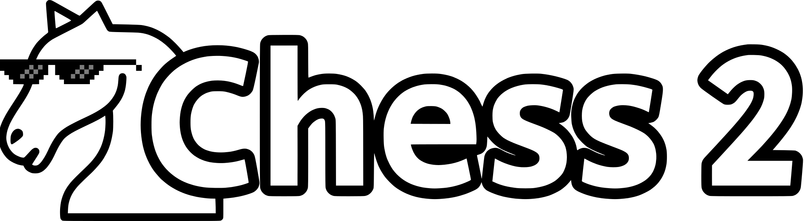

# Chess: The Anarchy Update

[Terms Of Service](https://anarchychess.org/tos) | [Privacy Policy](https://anarchychess.org/privacy) | [License](LICENSE)

[](https://discord.gg/qnkddndecq)

**Chess: The Anarchy Update** is a chess website that takes all the stupid ideas from [r/AnarchyChess](https://reddit.com/r/anarchychess) and turns them a real, balanced, chess variant.

**NOT OUT YET:** The website is not live yet. A public deployment will be available in the coming days.

# Features

- **New Pieces & Rules:** Knook, Checker, Traitor Rook, Antiqueen, Underage Pawn, King Capture, King Touch = Draw, Forced En Passant, Long Passant, Il Vaticano, Omnipotent Pawn, Vertical Castling, Knooklear Fusion, Queen Beta Decay.\
  _See the [full guide](https://anarchychess.org/guide) for detailed explanations of all pieces and rules_

- **Player Profiles:** Track ratings, game history and progress for each time control
- **Social Features:** Stars, blocks, in-game chat, leaderboards, direct challenges
- **Matchmaking:** Seek a game in any time control, all at once, rated or casual. Your seek is also displayed as an open seek, allowing players to accept it directly without having to go through the pool
- **Daily Quests:** Complete daily quests to climb the leaderboards and build a streak

# Screenshots

<div>
    
    
    
    
</div>

# Tech Stack

- **Backend:** C# With ASP.NET Core, structured with Orleans
- **Frontend:** Next.js + Typescript, styled with Tailwind
- **Database & Storage:** Currently configured for PostgreSQL and Azure Blob Storage. Other SQL databases and blob storage providers can be used by installing the appropriate EF Core and FluentStorage packages.

# Running Locally

## Backend Setup

1. Navigate to the backend directory

```bash
cd backend/AnarchyChess.Api
```

2. Restore dependencies

```bash
dotnet restore
```

3. Initialize & set secrets

```bash
dotnet user-secrets init

dotnet user-secrets set "AppSettings:Secrets:GoogleOAuth:ClientId" "<client-id>"
dotnet user-secrets set "AppSettings:Secrets:GoogleOAuth:ClientSecret" "<client-secret>"

dotnet user-secrets set "AppSettings:Secrets:DiscordOAuth:ClientId" "<client-id>"
dotnet user-secrets set "AppSettings:Secrets:DiscordOAuth:ClientSecret" "<client-secret>"

dotnet user-secrets set "AppSettings:Secrets:JwtSecret" "<jwt-secret>"

dotnet user-secrets set "AppSettings:Secrets:DatabaseConnString" "<connection-string>"
dotnet user-secrets set "AppSettings:Secrets:BlobStorageConnString" "<connection-string>"
dotnet user-secrets set "AppSettings:Secrets:QueueStorageConnString" "<connection-string>"
dotnet user-secrets set "AppSettings:Secrets:RedisConnString" "<connection-string>"
```

4. Run the backend server

```bash
dotnet run
```

## Frontend Setup

1. Navigate to the frontend directory

```bash
cd frontend
```

2. Install dependencies

```bash
npm install
```

3. Setup environment variables

    Create a .env file:

```
NEXT_PUBLIC_API_URL="https://localhost:7266"
```

4. Run the development server:

```bash
npm run dev
```

## Database Setup

1. Create a database

```sql
CREATE DATABASE anarchychess;
```

2. Set the connection string

```bash
dotnet user-secrets set "AppSettings:Secrets:DatabaseConnString" "<connection-string>"
```

3. Run Orleans SQL Setup Scripts

Run these scripts in order against your database:

```bash
backend/Scripts/Orleans
|- 001-query.sql
|- 002-reminders.sql
|- 003-storage.sql
|- 004-clustering.sql
```

4. Apply EF Core migrations

In development the backend automatically applies migrations on startup. Otherwise, run

```bash
dotnet ef database update
```

# Running Tests

## Backend

There are 3 test projects:

```bash
backend/Tests
|- AnarchyChess.Api.Unit
|- AnarchyChess.Api.Integration
|- AnarchyChess.Api.Functional
```

To run all backend tests:

```bash
cd backend
dotnet test AnarchyChess.Api.sln
```

## Frontend

The frontend uses Vitest for testing. Run all tests with:

```bash
cd frontend
npm run test
```

# Attributions

- **IP2Location LITE:** Anarchy Chess uses the IP2Location LITE database for [IP geolocation](https://lite.ip2location.com) to determine users' countries during signup.
